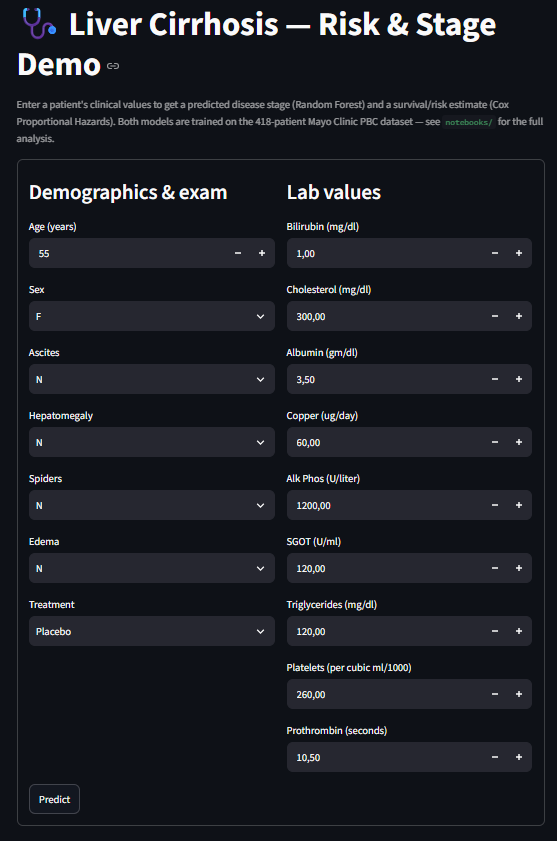
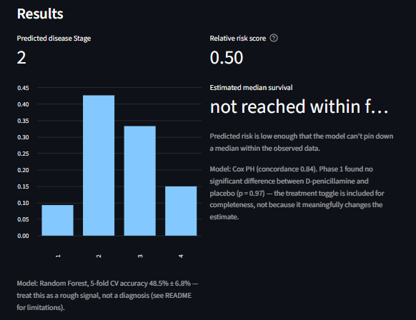

# Liver Cirrhosis — Survival Analysis & Stage Classification

**🔗 Live demo: [portfolio-project-5ghylnfrhvmiwmgo29eakw.streamlit.app](https://portfolio-project-5ghylnfrhvmiwmgo29eakw.streamlit.app/)**

Data Science portfolio project (Stackfuel). Mayo Clinic clinical trial data
on primary biliary cirrhosis (PBC) — 418 patients, comparing the drug
D-penicillamine against placebo.

## Data

`data/cirrhosis.csv` — included in this repository (418 rows, 32 KB).

Source: [Kaggle — fedesoriano/cirrhosis-prediction-dataset](https://www.kaggle.com/datasets/fedesoriano/cirrhosis-prediction-dataset), data files © original authors.

## Structure

```
Portfolie_project_DS/
├── data/
│   └── cirrhosis.csv               # included in the repo
├── notebooks/
│   ├── 01_survival.ipynb           # Kaplan-Meier + Cox PH
│   └── 02_classification.ipynb     # Stage prediction + SHAP
├── survival_analysis_deck.pptx
├── censoring_kaplan_meier_slide.pptx
├── app.py                          # Streamlit demo
└── pyproject.toml
```

## Setup

```bash
uv sync
uv run jupyter notebook notebooks/
```

## Demo app

Interactive Streamlit app: enter a patient's clinical values, get a predicted
disease Stage (Random Forest) and a survival/risk estimate (Cox PH) — reuses
the exact preprocessing and models from the two notebooks.

Try it live: **https://portfolio-project-5ghylnfrhvmiwmgo29eakw.streamlit.app/**

Or run it locally:

```bash
uv run streamlit run app.py
```

<p align="center">
  
  
</p>

## Plan

1. **Survival analysis** — Kaplan-Meier curves, Drug vs Placebo comparison, Cox Proportional Hazards ✅
2. **Classification** — predict `Stage` (1-4) from biomarkers, interpret with SHAP ✅
3. **Demo app** — interactive Streamlit prediction tool ✅

## Results

**Phase 1 — Survival analysis**
- Median survival across all 418 patients: **3395 days (≈9.3 years)**, estimated with Kaplan-Meier accounting for censoring (61.5% of the cohort).
- D-penicillamine shows **no statistically significant survival benefit** over placebo — confirmed by both a log-rank test (`p = 0.75`) and a multivariate Cox model (`p = 0.97`), matching the actual historical finding of the Mayo Clinic PBC trial.
- What predicts risk: **Bilirubin**, **Prothrombin time**, and disease **Stage** significantly increase risk; **Albumin** is protective — standard, biologically sensible liver-function markers.
- Limitation: the proportional-hazards assumption drifts over time for Bilirubin and Prothrombin (doesn't affect the Drug conclusion, which passes its own check).

**Phase 2 — Classification (disease Stage)**
- 276/418 patients had complete data on 15 biomarkers; target has real class imbalance (`Stage 1`: 12 patients vs. 94–111 for the rest).
- Model comparison: Logistic Regression (34% accuracy) → Random Forest, unregularized (100% train / 43% test — overfit) → Random Forest, regularized (**48.5% ± 6.8%** accuracy via 5-fold CV — the honest number).
- Given the class imbalance, accuracy alone isn't enough: balanced accuracy (**51.8% ± 5.8%**) and macro F1 (**44.7% ± 4.8%**) confirm the result is genuine, class-balanced performance, not the model just riding the majority classes.
- Most important predictor: **Hepatomegaly**, a simple clinical exam finding, outperforms every lab value.
- Interesting contrast with Phase 1: what predicts *death risk* (Bilirubin, Prothrombin, Albumin, Stage) differs from what predicts the *Stage label itself* (Hepatomegaly, Cholesterol, SGOT) — predicting severity and predicting survival aren't the same question.
- Biggest limitation: `Stage 1`'s 12 patients are too few for any model to learn reliably — a data problem, not a modeling one.
